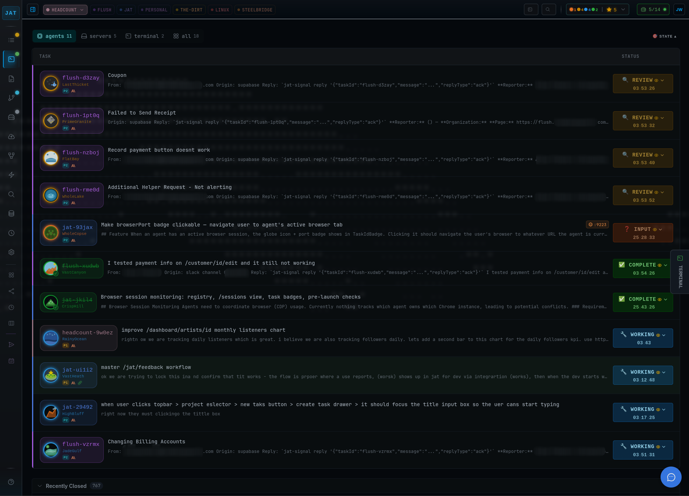

```
╔───────────────────────────────────────────╗
│                                           │
│           __       ___   .___________.    │
│          |  |     /   \  |           |    │
│          |  |    /  ^  \ `---|  |----`    │
│    .--.  |  |   /  /_\  \    |  |         │
│    |  `--'  |  /  _____  \   |  |         │
│     \______/  /__/     \__\  |__|         │
│                                           │
│         ◇ Supervise the Swarm ◇           │
│                                           │
╚───────────────────────────────────────────╝
```

# JAT — Autonomous Agents, Supervised or Not

**Agents ship, suggest, repeat. You supervise — or they run on their own.**

JAT is the complete, self-contained environment for agentic development. Task management, agent orchestration, code editor, git integration, terminal access—all unified in a single IDE. Connect RSS, Slack, Telegram, Gmail — events create tasks and spawn agents automatically. No plugins to install, no services to configure, no pieces to assemble. Supervise the swarm hands-on, or let it run autonomously while you sleep.

[](https://opensource.org/licenses/MIT)


[](https://discord.gg/AFJf93p7Bx)

<!-- [**Docs**](https://jat.tools) | [**Star this repo**](https://github.com/joewinke/jat/stargazers) -->


*The JAT IDE: agent sessions, task management, and code editor unified*

---

## The Paradigm Shift

```
Traditional IDE:       You write code, tools assist
Copilot IDE:           You write code, AI suggests completions
Agentic IDE:           Agents write code, you supervise and approve
Autonomous Platform:   Events trigger agents, work ships while you sleep
```

JAT supports all four. Manage 20+ agents hands-on, or connect external sources and let agents spawn themselves.

---

## Quick Start

```bash
# Install (one command)
curl -sSL https://raw.githubusercontent.com/joewinke/jat/master/tools/scripts/bootstrap.sh | bash

# Restart shell
source ~/.bashrc

# Launch
jat
```

Open http://localhost:3333 → Add a project → Create a task → Spawn an agent → Supervise

**Alternative (developers):**
```bash
git clone https://github.com/joewinke/jat.git ~/code/jat
cd ~/code/jat && ./install.sh
```

**VPS / Remote Server** (Arch Linux or Ubuntu):
```bash
curl -sSL https://raw.githubusercontent.com/joewinke/jat/master/tools/scripts/vps-setup.sh | bash
```
Sets up everything — swap, Node.js, Tailscale, Claude Code, firewall, JAT, and a systemd service that auto-starts on boot and restarts on crash. Access via `http://<tailscale-ip>:3333`.

---

## Complete IDE Features

### Keyboard Shortcuts

| Shortcut | Feature |
|----------|---------|
| `Cmd+K` | **Global Search** — files, tasks, agents |
| `Cmd+Shift+T` | **Terminal** — integrated with agent sessions |
| `Ctrl+S` | **Save** — save current file |
| `Alt+N` | **New Task** — create from anywhere |
| `Alt+E` | **Epic Swarm** — launch parallel agents |

### Code Editor (`/files`)

Full Monaco editor (VS Code's engine):

```
┌─────────────────────────────────────────────────────────────┐
│  📁 Files  │  🔀 Git                                        │
├─────────────────────────────────────────────────────────────┤
│  ▼ src/    │  ┌─────┬─────┬─────┐                           │
│    lib/    │  │ a.ts│ b.ts│ c.ts│  ← Drag-drop tabs         │
│    routes/ │  └─────┴─────┴─────┘                           │
│  ▼ tests/  │  ┌──────────────────────────────────────────┐  │
│            │  │  Monaco Editor                           │  │
│            │  │  • 25+ languages                         │  │
│            │  │  • Syntax highlighting                   │  │
│            │  │  • Multi-cursor editing                  │  │
│            │  └──────────────────────────────────────────┘  │
└─────────────────────────────────────────────────────────────┘
```

- Lazy-loading file tree with right-click context menu
- Multi-file tabs with persistent order
- Keyboard navigation (F2 rename, Delete remove)
- File type icons

### Git Source Control (`/files` → Git tab)

Full git integration:

```
┌─────────────────────────────────────────────────────────────┐
  ⎇ master  ↑2 ↓0                                   [⟳ Fetch] │
├─────────────────────────────────────────────────────────────┤
│  ▼ STAGED CHANGES (3)                               [− All] │
│    M  src/lib/api.ts                                        │
│    A  src/lib/auth.ts                                       │
├─────────────────────────────────────────────────────────────┤
│  [ Commit message...                          ] [✓ Commit]  │
├─────────────────────────────────────────────────────────────┤
│  ▼ CHANGES (2)                                      [+ All] │
│    M  src/routes/+page.svel te                    [+] [↻]   │
├─────────────────────────────────────────────────────────────┤
│  [↑ Push]  [↓ Pull]                                         │
├─────────────────────────────────────────────────────────────┤
│  ▼ TIMELINE                                                 │
│    ● abc123  2h ago   Add authentication                    │
│    ○ def456  1d ago   Fix login bug                         │
└─────────────────────────────────────────────────────────────┘
```

- Stage/unstage individual files or all
- Commit with `Ctrl+Enter`
- Push/Pull with ahead/behind indicators
- Branch switcher with search
- Diff preview drawer (click any file)
- Commit timeline with details

### Agent Sessions (`/tasks`)

Live terminal output for all running agents:

- Real-time streaming output
- Smart question UI (agent questions → clickable buttons)
- State badges: Working, Needs Input, Review, Completed
- Send input directly to agents
- Token usage and cost tracking

### Task Management (`/tasks`)

JAT Tasks-powered issue tracking:

- Create tasks with priorities (P0-P4)
- Epic workflows with subtask spawning
- Dependency visualization
- Bulk actions (select multiple, add to epic)

### Source Control (`/source`)

Full commit history and repository management:

- Browse all commits with details
- Multi-select commits for cherry-pick or revert
- Search commits by message or author
- Diff viewer for any commit

---

## The Agentic Flywheel

```
┌──────────────────────────────────────────────────────────────┐
│                                                              │
│   1. PLAN WITH AI        Describe your feature, get PRD      │
│         ↓                                                    │
│   2. /JAT:TASKTREE           Convert PRD → structured tasks  │
│         ↓                                                    │
│   3. EPIC SWARM          Spawn agents on subtasks            │
│         ↓                                                    │
│   4. PARALLEL WORK       Watch agents code simultaneously    │
│         ↓                                                    │
│   5. SMART QUESTIONS     "OAuth or JWT?" → click button      │
│         ↓                                                    │
│   6. REVIEW IN /tasks    See diffs, approve changes          │
│         ↓                                                    │
│   7. COMMIT & PUSH       Stage, message, push                │
│         ↓                                                    │
│   8. AUTO-PROCEED        Low-priority tasks complete auto    │
│         ↓                                                    │
│   9. SUGGESTED TASKS     Agent proposes next work            │
│         ↓                                                    │
│        ╰──────────────── Auto-accept → back to 3 ───────────╯│
│                                                              │
│            ∞  Perpetual motion. Ship continuously.  ∞        │
│                                                              │
└──────────────────────────────────────────────────────────────┘
```

---

## Integrations & Autonomous Triggers

JAT connects to external sources. When events arrive, tasks are created and agents spawn — no human in the loop required.

### Built-in Integrations

| Integration | Source | Example |
|-------------|--------|---------|
| **Telegram** | Chat messages | DM your bot a request, agent acts instantly |
| **Slack** | Channel messages | Team requests from #support spawn agents |
| **RSS** | Any RSS/Atom feed | Monitor blogs, CI feeds, Hacker News |
| **Gmail** | Email inbox | Forward client emails, agent processes them |
| **Custom** | Plugin system | Any API or data source ([PLUGINS.md](./tools/ingest/PLUGINS.md)) |

### Trigger Modes

| Mode | When Agent Spawns | Use Case |
|------|-------------------|----------|
| **Immediate** | Instantly on event | Telegram: message JAT, agent starts now |
| **Delay** | After N min/hours | Batch morning emails, start after lunch |
| **Schedule** | At a specific time | "Process feed items at 9 AM" |
| **Cron** | Recurring schedule | "Every weekday at 9 AM, review PRs" |

### Example: Telegram to Shipped Code

```
1. You message your Telegram bot: "Add dark mode to the settings page"
2. JAT ingest daemon receives the message
3. Task created: "Add dark mode to the settings page" (P1, immediate trigger)
4. Agent spawns automatically, picks up the task
5. Agent writes code, commits, opens PR
6. You wake up to a completed PR
```

### Task Scheduler

The built-in scheduler daemon (`jat scheduler start`) handles cron and one-shot triggers. It polls task databases, spawns agents for due tasks, and manages recurring schedules automatically. See [scheduler docs](./shared/scheduler.md).

### Custom Integrations

Build your own adapter with the plugin system. See [PLUGINS.md](./tools/ingest/PLUGINS.md) for the adapter interface.

---

## Routes

| Route | Purpose |
|-------|---------|
| `/tasks` | Agent sessions, task management, epics, questions, state tracking |
| `/files` | Monaco editor, file tree, staged/unstaged changes |
| `/source` | Full commit history, cherry-pick, revert, diffs |
| `/integrations` | External source connections (RSS, Slack, Telegram, Gmail) |
| `/servers` | Dev server controls, task scheduler management |
| `/config` | API keys, project secrets, automation rules, shortcuts |

---

## What Makes JAT Different

| Feature | Description |
|---------|-------------|
| **Multi-agent management** | Run 20+ agents simultaneously across your codebase |
| **Task → Agent → Review** | One-click workflow from task to completion |
| **Smart question UI** | Agent questions become clickable buttons |
| **Epic Swarm** | Spawn parallel agents on subtasks |
| **Auto-proceed rules** | Configure auto-completion by type/priority |
| **External integrations** | RSS, Slack, Telegram, Gmail feed events into tasks |
| **Autonomous triggers** | Events spawn agents automatically (immediate/delay/schedule/cron) |
| **Task scheduling** | Cron-based recurring tasks and one-shot scheduled spawns |
| **Error recovery** | Automatic retry patterns for failures |
| **PRD → Tasks** | `/jat:tasktree` converts requirements to structured tasks |
| **Skill marketplace** | Install community skills, auto-synced to all agents |

Full Monaco editor and git integration included—but the magic is in agent orchestration.

---

## JAT vs Other AI Coding Tools

| Feature | JAT | Cursor | Windsurf | Cline/Aider |
|---------|-----|--------|----------|-------------|
| **Multi-agent (20+)** | ✅ | ❌ | ❌ | ❌ |
| **Visual IDE** | ✅ | ❌ | ❌ | ❌ |
| **Task management** | ✅ Built-in | ❌ | ❌ | ❌ |
| **Epic Swarm (parallel)** | ✅ | ❌ | ❌ | ❌ |
| **Agent coordination** | ✅ Agent Registry | ❌ | ❌ | ❌ |
| **External integrations** | ✅ RSS, Slack, Telegram, Gmail | ❌ | ❌ | ❌ |
| **Autonomous triggers** | ✅ | ❌ | ❌ | ❌ |
| **Auto-proceed rules** | ✅ | ❌ | ❌ | ❌ |
| **Code editor** | ✅ Monaco | ✅ VS Code | ✅ VS Code | ❌ |
| **Git integration** | ✅ | ✅ | ✅ | Partial |
| **Skill marketplace** | ✅ Install & auto-sync | ❌ | ❌ | ❌ |
| **Supabase integration** | ✅ Migrations | ❌ | ❌ | ❌ |
| **100% local** | ✅ | ❌ Cloud | ❌ Cloud | ✅ |
| **Open source** | ✅ MIT | ❌ | ❌ | ✅ |

JAT isn't trying to replace your editor — it's the control tower for your agent swarm, whether you're at the controls or asleep.

---

## Architecture

```
~/code/jat/
├── ide/          # SvelteKit app (the IDE)
│   └── src/
│       ├── routes/     # /tasks, /files, /source, /integrations, /servers, /config
│       └── lib/
│           ├── components/files/   # FileTree, GitPanel, Editor
│           ├── components/work/    # SessionCard, WorkPanel
│           ├── components/source/  # CommitHistory, DiffViewer
│           ├── components/ingest/  # Integration management UI
│           └── stores/             # State management
├── tools/              # 50+ CLI tools
│   ├── core/           # Database, monitoring
│   ├── mail/           # Agent coordination (am-*)
│   ├── browser/        # Browser automation
│   ├── ingest/         # Feed ingest daemon (RSS, Slack, Telegram, Gmail)
│   ├── scheduler/      # Task scheduling daemon (cron + one-shot)
│   └── signal/         # State sync
├── commands/           # /jat:start, /jat:complete, /jat:tasktree
└── shared/             # Agent documentation
```

---

## Requirements

- **Node.js** 20+
- **tmux** (agent sessions)
- **Claude Code** or similar AI assistant
- **sqlite3**, **jq** (auto-installed)

---

## Authentication

**No API keys required.** JAT uses your existing AI assistant subscriptions.

Most coding agents authenticate via their own subscriptions — no separate API keys needed:

| Agent | Auth Method | Setup |
|-------|-------------|-------|
| Claude Code | Claude Pro/Max subscription | `claude auth` |
| Codex CLI | ChatGPT Plus/Pro subscription | `codex login` |
| Gemini CLI | Google Account (free tier included) | First run triggers OAuth |
| Aider | API keys only | Set provider key in env |

JAT's built-in AI features (task suggestions, avatars) use an **auto-fallback** system:
1. **Anthropic API key** — if configured (optional)
2. **Claude CLI** — falls back to your Claude subscription via `claude -p`

If you have Claude Code installed and authenticated, AI features work out of the box with zero configuration.

---

## Configuration

`~/.config/jat/projects.json`:

```json
{
  "projects": {
    "myapp": {
      "path": "~/code/myapp",
      "port": 3000
    }
  },
  "defaults": {
    "max_sessions": 12,
    "model": "opus",
    "scheduler_autostart": true,
    "timezone": "America/New_York"
  }
}
```

**Optional:** API keys and project secrets can be managed at `/config` → API Keys tab, or stored in `~/.config/jat/credentials.json`:

```json
{
  "apiKeys": {
    "anthropic": { "key": "sk-ant-..." }
  },
  "customApiKeys": {
    "stripe": { "value": "sk_live_...", "envVar": "STRIPE_API_KEY" }
  },
  "projectSecrets": {
    "myapp": { "supabase_anon_key": { "value": "..." } }
  }
}
```

Access secrets in scripts:
```bash
jat-secret stripe              # Get value
eval $(jat-secret --export)    # Load all as env vars
```

IDE settings at `/config`:
- API keys and custom secrets (optional)
- Per-project credentials (Supabase, databases)
- Agent routing rules
- Automation rules
- Keyboard shortcuts

---

## Documentation

| Doc | Purpose |
|-----|---------|
| [QUICKSTART.md](./QUICKSTART.md) | 5-minute tutorial |
| [CLAUDE.md](./CLAUDE.md) | Full technical reference |
| [ide/CLAUDE.md](./ide/CLAUDE.md) | IDE dev guide |
| [shared/scheduler.md](./shared/scheduler.md) | Scheduler daemon reference |
| [tools/ingest/PLUGINS.md](./tools/ingest/PLUGINS.md) | Custom integration plugin guide |
| [shared/](./shared/) | Agent documentation |

---

## FAQ

**Which AI assistants work?**
Any terminal-based AI: Claude Code, Aider, Cline, Codex, etc.

**How many agents can I run?**
Tested with 20+. Limited by your machine and API limits, not JAT.

**Can I use existing projects?**
Yes. Run `jt init` in any git repo to initialize task tracking, then add the project via `/config` → Projects tab, or use the "Add Project" button on the Tasks page.

**Can JAT act on Slack/Telegram messages?**
Yes. The ingest daemon connects to Telegram bots, Slack channels, RSS feeds, and Gmail. Incoming events create tasks and spawn agents automatically — immediately, on a delay, at a scheduled time, or on a cron. See [Integrations](#integrations--autonomous-triggers).

**Can I schedule recurring tasks?**
Yes. Set a cron expression on any task and the scheduler daemon will spawn agents automatically. See [scheduler docs](./shared/scheduler.md).

**Is there a hosted version?**
No hosted service. JAT runs on your own machine or your own VPS — code never leaves infrastructure you control.

---

## Community

- **Discord** — [Join the JAT community](https://discord.gg/AFJf93p7Bx) for help, discussion, and sharing what you've built
- **Issues** — [Report bugs or request features](https://github.com/joewinke/jat/issues)
- **Discussions** — [GitHub Discussions](https://github.com/joewinke/jat/discussions) for questions and ideas

---

## Contributing

We welcome contributions! See [CONTRIBUTING.md](./CONTRIBUTING.md) for guidelines.

**Quick start for contributors:**
```bash
git clone https://github.com/joewinke/jat.git ~/code/jat
cd ~/code/jat/ide
npm install && npm run dev
```

Open a PR against `master`. All contributions are licensed under MIT.

---

## Credits

- **[Joe Winke](https://x.com/joewinke)** — Creator [Github](https://github.com/joewinke)
- **Agent Registry** — Original Agent Comms inspiration ([Dicklesworthstone/mcp_agent_mail](https://github.com/Dicklesworthstone/mcp_agent_mail))
- **Beads** — Original task management inspiration ([steveyegge/beads](https://github.com/steveyegge/beads))
- **Mario Zechner** — Think different about Agents ([What if you don't need MCP?](https://mariozechner.at/posts/2025-11-02-what-if-you-dont-need-mcp/))
- **Andrej Karpathy** - Naming the Problem ([Some Powerful Alien Tool](https://x.com/karpathy/status/2004607146781278521?s=20))
- **DHH** - Developer-centric OS ([Omarchy](https://omarchy.org/))
- **Tmux** - Terminal Multiplexer by ([Nicholas Marriott](https://github.com/tmux/tmux))
- **Monaco** — Code editor engine ([Microsoft](https://github.com/microsoft/monaco-editor))
- **SvelteKit** — IDE framework ([Rich Harris](https://github.com/Rich-Harris))
- **Tailwind CSS** — Utility-first CSS ([Adam Wathan](https://github.com/adamwathan))
- **DaisyUI** — Component library ([Pouya Saadeghi](https://github.com/saadeghi))
- **Git** — Version control ([Linus Torvalds](https://github.com/torvalds))
- **simple-git** — Node.js Git wrapper ([Steve King](https://github.com/steveukx))
- **D3.js** — Data visualization ([Mike Bostock](https://github.com/mbostock))
- **Vite** — Build tool ([Evan You](https://github.com/yyx990803))
- **SQLite** — Embedded database ([D. Richard Hipp](https://www.sqlite.org/crew.html))
- **TypeScript** — Type safety ([Anders Hejlsberg](https://github.com/ahejlsberg))
- **Claude** — Wrote a lot of the code ([Anthropic](https://anthropic.com))

---

## License

MIT - This is my gift to all the great's who haved gifted so much to all of us. If you use this software, use it to make something you give back to open-source.

---

## Star History

[](https://www.star-history.com/#joewinke/jat&type=timeline&legend=top-left)

---
**JAT: Supervise the swarm — or let it run autonomously.**

[Install](#quick-start) | [Docs](./QUICKSTART.md) | [Discord](https://discord.gg/AFJf93p7Bx) | [Issues](https://github.com/joewinke/jat/issues)
